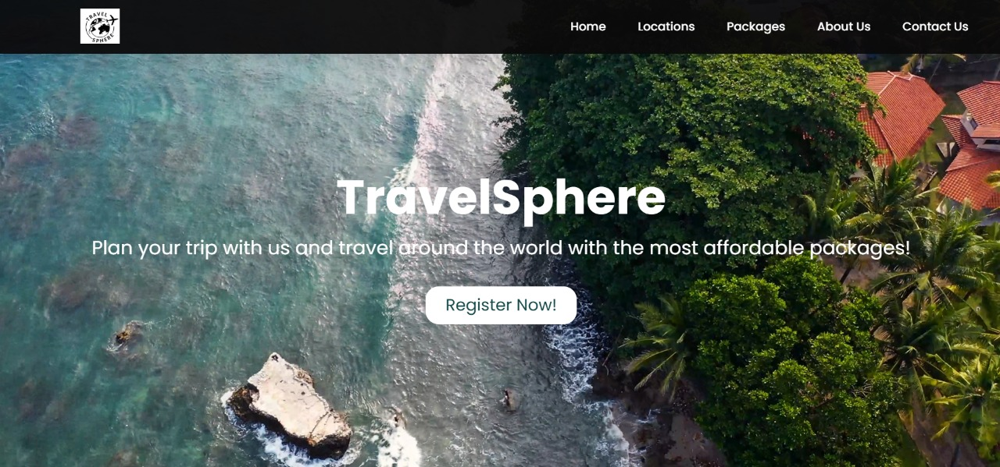
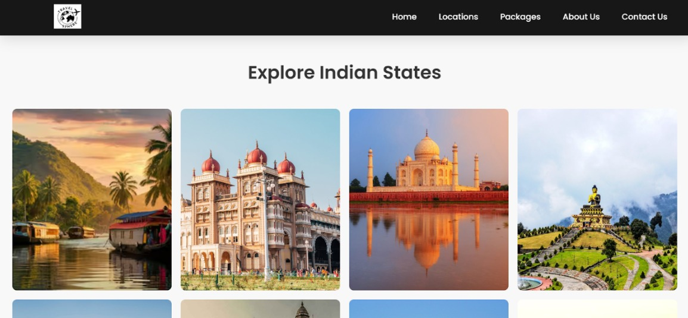
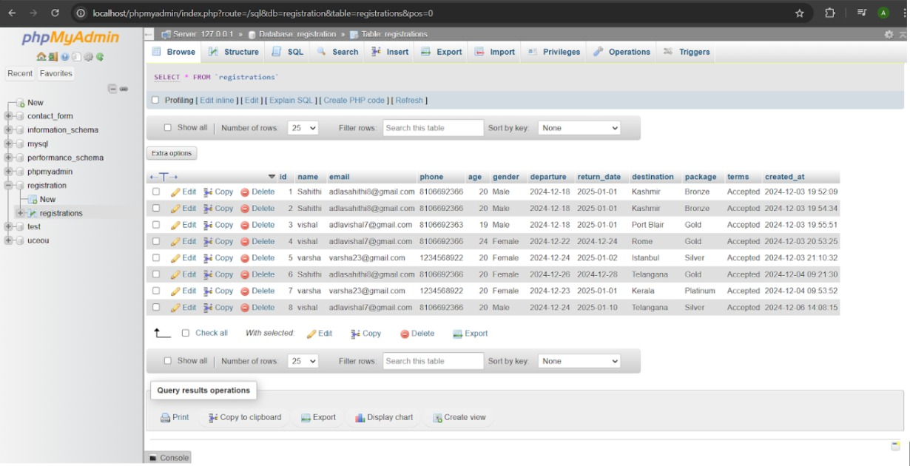

# 🌍 TravelSphere – Your Gateway to Travel Adventures

**TravelSphere** is a dynamic tourism website that allows users to explore curated travel destinations across India. From historical landmarks and serene nature spots to adrenaline-pumping adventures, TravelSphere is a complete guide for travel enthusiasts.

---

## 📌 Project Overview

TravelSphere is designed to provide categorized tourist information across 8 Indian states, while also enabling users to register, and contact the service team for inquiries.

---

## 🎯 Objectives

- Display categorized tourist destinations (Historical, Nature, Adventure)  
- Enable user registration and data storage  
- Provide travel package details (Bronze, Silver, Gold, Platinum)  
- Facilitate user queries through a contact form  

---

## 🛠️ Tech Stack

| Layer     | Technologies                      |
|-----------|-----------------------------------|
| Frontend  | HTML, CSS, JavaScript             |
| Backend   | PHP                               |
| Database  | MySQL (via XAMPP)                 |
| Tools     | Visual Studio Code, phpMyAdmin    |
| Server    | Apache (XAMPP Server)             |

---

## 🌐 Website Features

- **Home Page:** Introductory video, services, destination cards (Kerala, Karnataka, Telangana, Punjab, Rajasthan, Maharashtra, Uttar Pradesh, West Bengal)  
- **State Pages:** Flip cards with filters for Historical, Nature, and Adventure categories  
- **Packages:** Bronze, Silver, Gold, and Platinum tiers  
- **About Us:** Vision, mission, and services overview  
- **Registration Page:** Form with JavaScript validation and PHP-MySQL integration  
- **Contact Us:** Query form with prompt and validation   

---

## 🎥 Output Screenshots

## ✅ Conclusion
TravelSphere is a complete, responsive tourism website integrating both frontend and backend functionalities. It simplifies trip planning with categorized destinations and user-friendly features. With future enhancements, it can become a robust platform for travelers.

---

## 👥 Authors
Adla Sahithi

Sagarika Jandhyala

